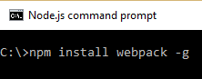
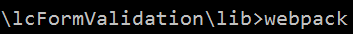
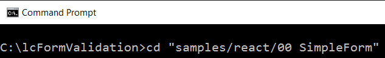
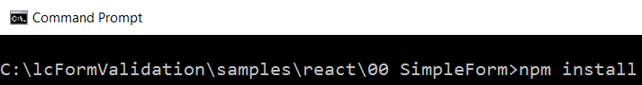
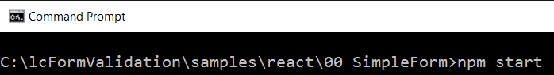
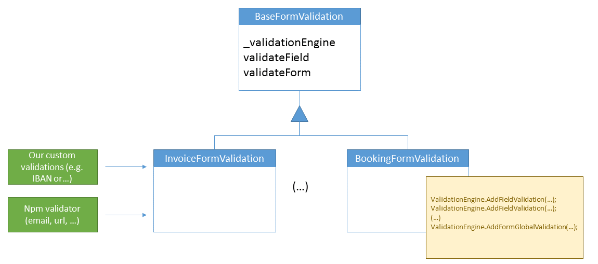
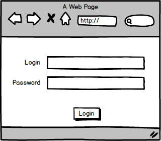

# lcFormValidation Library #


lcFormValidation is a form library validation:

* Heavily based on JavaScript (no html attributes annotations).
* Full async, all validations are processed as async.

lc-FormValidation is third party / framework agnostic, although it will integrate quite well with libraries like React / Redux.

# How to run a sample #

**Work in progress: we are working on closing a first release of this library, we expect to register it in npm in the following two three weeks, in the mean time you can download the source code and run the samples following the instructions below.**


Prerequisites: In order to get these examples up and running you will have to get installed typings and webpack node modules globally. 





If you want to start from the source code, follow this steps:

First download the source code from Git.

* Navigate to the lib folder (Note: this process will be less painful and added to preinstall when the following [bug](https://github.com/npm/npm/issues/10379) gets fixed on npm.

* Execute npm install


* Execute webpack



* Navigate to one the samples folders, e.g. "samples/react/00 Simple Form".



* Execute npm install (this is connected to the local lib folder(*)).




* Execute npmn start




* Open your favourite browser and navigate to http://localhost/8080


# Why another form library? #

Form validation is a complex issue, usually we can find solutions that cover the simple scenarios and are focused on building RAD development just by adding some attributes / annotations to given fields or HTML fields (e.g. input), the disadvantage that we have found to this approach:

* There are different approaches for each scenario: sometimes you have to add some tweaking for async validations, some other take care of special scenarios (like validations that depends on more than one field).

* Usually you can easily unit test one validation (directive / annotation), but testing the whole form is a complex task (directives are coupled to e.g. HTML).

* Validations are tightly coupled to e.g. directives or markup is not easy to reuse this validation code in e.g. server side (universal javascript).

# Approach #

In a form validation we can find features / code that can be placed in a base class (baseFormValidation):

* ValidateField: Validates a single field (e.g. call this when controls content change or the control looses the focus).
* ValidateForm: Validates the whole form (all fields, plus global validations).


Then we can inherit from that base class and define our own specific form validations:

* Add in the constructor of the inherited class the mappings between form field Id's and form and entity field Id, plus defining the validations per field to be executed. 

The idea is to encapsulate all the common functionality in a base class, and create independent classes that will inherit from this base class to implement the validation of each individual form.



By following this approach:

* We encapsulate all the generic validation plumbing in a base class.
* We can implement real world form validation in the specific classes.
* We can benefit from external validation libraries (validate emails, url, iban ...), wihtout having to implement additional scaffolding (e.g. create a directive for this validation).
* We can easily test (plain javascript framework agnostic):
    * The formValidationBase.
    * Each specific form validation class.
    * The generic validator helpers.
* We can just run this javascript code in the client and serverside (e.g. node solution) ** (NOTE) We expect to create a sample showing how this could be implemented soon.*
*
# FormBaseValidation + Sample Form #

FormBaseValidation implementation (already implemented by the library):


```
export class BaseFormValidation {
    _validationEngine: IValidationEngine;

    constructor() {
        this._validationEngine = new ValidationEngine();
    }

    public validateField(vm: any, key: string, value: any, filter : any = consts.defaultFilter): Promise<FieldValidationResult> {
        return this._validationEngine.triggerFieldValidation(vm, key, value, filter);
    }

    public validateForm(vm: any): Promise<FormValidationResult> {
        return this._validationEngine.validateFullForm(vm);
    }
}
```

Let's say we want to add validation support for a login form (validations to be performed: name field is required).



Login form validation implementation


```
  public constructor() {
      super();

      this._validationEngine.initialize([
          {formFieldName: 'fullname', vmFieldName: 'fullname'},
          {formFieldName: 'password', vmFieldName: 'password'}
      ]);

      // TODO: Implement Issue #17
      // TODO: Implement Issue #6
      this._validationEngine.addValidationRuleToField('fullname',
                                            (vm, value) : Promise<FieldValidationResult> => {
                                                // Required field
                                                // in this case no async stuff
                                                // we can directly resolve the promise
                                                let isFieldInformed : boolean = (value && value.length > 0);
                                                // We could use string ID's if multilanguage is required
                                                let errorInfo : string = (isFieldInformed) ? "" : "Mandatory field";

                                                const validationResult : FieldValidationResult = new FieldValidationResult();
                                                validationResult.type = "REQUIRED";
                                                validationResult.succeeded = isFieldInformed;
                                                validationResult.errorMessage = errorInfo;

                                                return Promise.resolve(validationResult);
                                            }
                                            )


  }
}

```


# Samples forms implemented #

Samples running with React + Redux:
* Basic login.
* Signup form (including async validation against GitHub user api).
* Quiz form.

We are looking for contributors to implement samples and support for libraries such as Angularjs, Ember... if you would like to cooperate don't hesitate contacting us.

# Future Enhancements #

* Prepare npm package install.
* Add CI integration.
* Allow connecting with array fields / table like scenario.
* Allow this to be easily be used outside the context of a web form (e.g. rest api server side)
